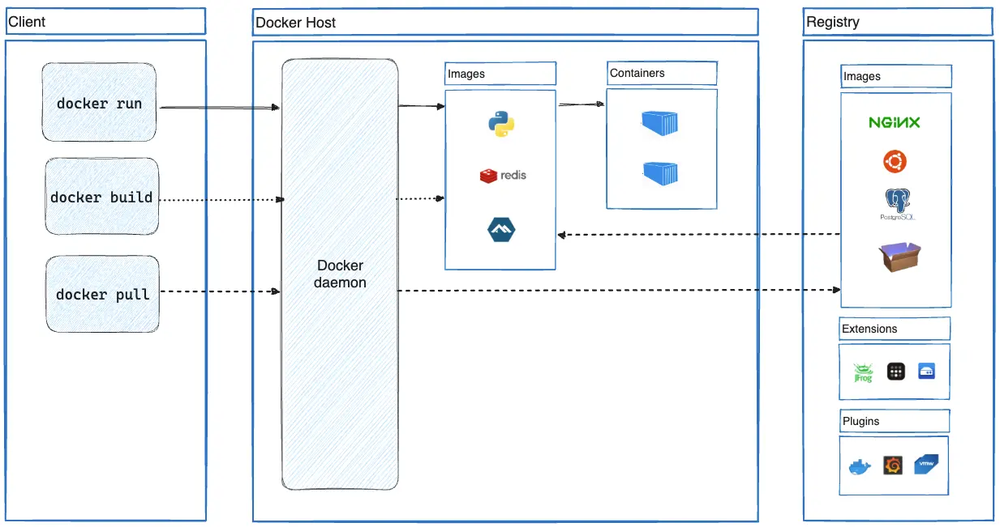

# Docker

### [Documentation](https://docs.docker.com/)

## [Docker architecture](https://docs.docker.com/guides/docker-overview/#docker-architecture)

Docker uses a client-server architecture. The Docker client talks to the Docker daemon, which does the heavy lifting of building, running, and distributing your Docker containers. The Docker client and daemon can run on the same system, or you can connect a Docker client to a remote Docker daemon. The Docker client and daemon communicate using a REST API, over UNIX sockets or a network interface. Another Docker client is Docker Compose, that lets you work with applications consisting of a set of containers.

## [Dockerfile reference](https://docs.docker.com/reference/dockerfile/)

